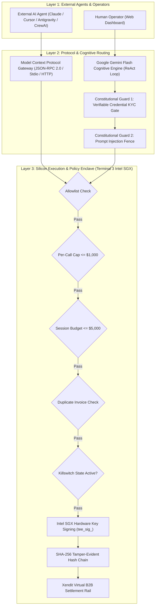

# VaultPay System Architecture & Cryptographic Security Model

## 1. Executive Summary & Problem Statement

Autonomous AI agents (DevOps engineers, data pipeline runners, AI researchers) are increasingly capable of executing complex operational workflows. However, deploying agents with corporate purchasing authority introduces an existential financial vulnerability:

> **The Fundamental Dilemma:** If an AI agent holds raw corporate credit cards or unrestricted API keys, a single prompt injection attack, hallucination, or infinite loop can drain enterprise treasury accounts in minutes. Conversely, requiring human approval for every micro-transaction eliminates the speed and autonomy advantages of AI systems.

**VaultPay resolves this dilemma through a strict separation of cognition from financial execution:**
- **Cognition (Untrusted / Non-Financial):** Handled by Google Gemini Flash in a ReAct loop.
- **Protocol Interface:** Governed by the open **Model Context Protocol (MCP)** specification.
- **Execution & Policy Gate (Cryptographically Sealed in Silicon):** Governed by **Terminal 3 Intel SGX Hardware Enclaves**. Private keys, financial limits, and vendor allowlists never enter LLM memory. Even under total model compromise, the physical Intel SGX CPU halts unauthorized capital movement.

---

## 2. High-Level Architectural Layers

---

## 3. Detailed Component Breakdown

### A. Cognitive Layer (Google Gemini Flash)
The cognitive brain operates in a structured **ReAct (Reasoning + Acting)** framework:
1. **Decomposition:** Parses free-form user directives into structured procurement goals.
2. **Intent Classification:** Classifies requests into `PROCUREMENT_DIRECTIVE`, `CATALOG_QUERY`, or `CONVERSATION`.
3. **Entity Extraction:** Extracts vendor names, transaction limits, asset specifications, and department codes.
4. **Adversarial Sanitization:** Runs pattern-matching heuristics on vendor quote memos and supplier metadata to detect indirect prompt injections before passing payloads to downstream tools.

### B. Protocol Gateway (Model Context Protocol - MCP)
Complies with the official `@modelcontextprotocol/sdk` standard, exposing:
- **`vaultpay_get_budget`**: Queries real-time hardware-enforced limits and Intel SGX attestation state.
- **`vaultpay_query_catalog`**: Dynamic search across pre-approved infrastructure suppliers.
- **`vaultpay_procure`**: Triggers hardware-bounded procurement inside the TEE enclave.
- **`vaultpay_verify_ledger`**: Audits chronological SHA-256 hash chains.
- **`vaultpay_emergency_kill`**: Hardware-level key revocation.

### C. Execution Gate (Terminal 3 Intel SGX TEE Enclave)
Implemented in Rust (`contract/src/lib.rs`) and replicated in TypeScript (`agent/src/t3nEnclave.ts`):
- **Physical Memory Isolation:** Execution policies run inside encrypted memory pages (PRM) inaccessible to host operating system or hypervisors.
- **Hardware Allowlist:** Fixed supplier registry (`CloudForge`, `DataStream AI`, `Xendit`, `ComputePool KL`).
- **Per-Call Hard Cap:** Hardcoded at `$1,000.00` (100,000 cents). Any order exceeding this limit is rejected at the firmware level.
- **Session Budget:** Hardcoded ceiling of `$5,000.00` (500,000 cents).
- **Idempotency Register:** Tracks processed `invoiceId` nonces to block replay attacks.
- **Emergency Revocation:** One-way latch that immediately freezes all future signing operations.

---

## 4. End-to-End Autonomous Procurement Sequence

```mermaid
sequenceDiagram
    autonumber
    actor ExternalAgent as Autonomous AI Agent
    participant MCP as VaultPay MCP Server
    participant SGX as Terminal 3 Intel SGX Enclave
    participant Rail as Xendit Settlement Rail
    participant Ledger as SHA-256 Audit Ledger

    ExternalAgent->>MCP: vaultpay_get_budget()
    MCP-->>ExternalAgent: { remainingBudget: $5,000.00, perCallCap: $1,000.00, enclaveDid }

    ExternalAgent->>MCP: vaultpay_query_catalog({ category: "Infrastructure" })
    MCP-->>ExternalAgent: { vendor: "ComputePool KL", item: "Bare-Metal Node", price: $725.50 }

    ExternalAgent->>MCP: vaultpay_procure(vendor: "ComputePool KL", amountCents: 72550)
    MCP->>SGX: executePayVendor("ComputePool KL", 72550, quoteId)
    
    rect rgb(20, 30, 50)
        Note over SGX: Silicon Policy Verification
        SGX->>SGX: 1. Vendor in Allowlist? (Pass)
        SGX->>SGX: 2. $725.50 <= $1,000.00 Cap? (Pass)
        SGX->>SGX: 3. $725.50 <= $5,000.00 Budget? (Pass)
        SGX->>SGX: 4. Duplicate Invoice? (Pass)
        SGX->>SGX: 5. Killswitch Revoked? (Pass)
    end

    SGX->>SGX: Deduct remaining budget to $4,274.50
    SGX->>SGX: Sign hardware attestation (tee_sig_<hex>)
    SGX->>Ledger: Append Block #1 (prevHash -> entryHash)
    SGX->>Rail: Authorize Virtual Account Settlement
    Rail-->>SGX: Settlement Confirmed (TxID: 0xt3_<hex>)
    SGX-->>MCP: { status: "APPROVED", txId, blockIndex: 1, signature, remainingBudget: $4,274.50 }
    MCP-->>ExternalAgent: Enclave Signed Receipt
```

---

## 5. Cryptographic Proof & Ledger Formula

VaultPay maintains an immutable, chronological ledger where every block cryptographically seals the preceding state:

### Block Structure
$$\text{Block}_n = \{ \text{index}, \text{timestampMs}, \text{vendor}, \text{amountCents}, \text{invoiceId}, \text{status}, \text{prevHash}, \text{entryHash}, \text{enclaveSignature} \}$$

### Entry Hash Computation
$$\text{entryHash}_n = \text{SHA256}(\text{index} \parallel \text{timestampMs} \parallel \text{vendor} \parallel \text{amountCents} \parallel \text{invoiceId} \parallel \text{status} \parallel \text{prevHash}_n)$$

Where:
$$\text{prevHash}_0 = 0000000000000000000000000000000000000000000000000000000000000000_{64}$$
$$\text{prevHash}_n = \text{entryHash}_{n-1} \quad (\text{for } n \ge 1)$$

### Enclave Hardware Signature
$$\text{enclaveSignature}_n = \text{tee\_sig\_} \parallel \text{SHA256}(\text{entryHash}_n \parallel \text{enclaveDid})[0..32]$$

Any tampering with transaction amounts, timestamps, or vendor names invalidates the downstream hash chain, producing verifiable cryptographic proof of alteration.

---

## 6. Distributed State Synchronization

To support serverless environments (e.g. Vercel Lambda) without state desynchronization:
1. **Direct Telemetry Delivery:** Every mutating transaction immediately bundles the full enclave state (`TEEPolicyStatus`) in the response payload.
2. **Cold-Lambda Defense:** Background polling clients check `prev.ledger.length > incoming.ledger.length`. If an incoming poll arrives from a cold instance containing stale or empty data, it is automatically discarded.
3. **Durable Persistence:** Warm instances serialize ledger history and remaining budgets to durable filesystem storage (`/tmp/vaultpay_enclave_state.json`), ensuring continuity across invocations.
